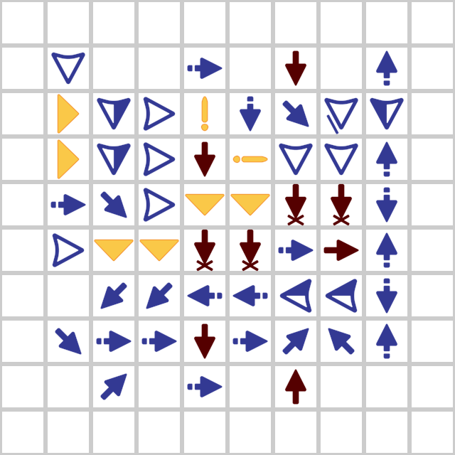

| Характеристика | Значение                |
|----------------|-------------------------|
| Автор          | Gulg                    |
| Объём          | 1024 Байта              |
| Тип ячеек      | Расширенные кольцевые   |
| Состав кольца  | 2 байта + сигнал начала |

||| Ячейка
:::code source="./cell_schematic.txt" :::

||| Полная память
:::code source="./full_schematic.txt" :::

|||